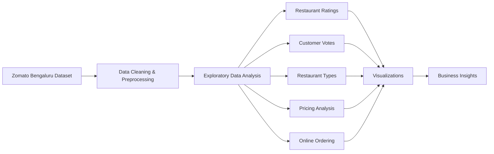

# Zomato Restaurant Data Analysis

> **An exploratory data analysis (EDA) project that uncovers customer preferences, restaurant trends, and pricing patterns within Bengaluru's restaurant ecosystem using Python and data visualization.**

Understanding customer behavior is essential for restaurants and food delivery platforms alike. This project analyzes the **Zomato Bengaluru Restaurant Dataset** to identify meaningful trends in restaurant ratings, customer engagement, pricing, online ordering, and restaurant categories through exploratory data analysis.

Using Python and modern data visualization libraries, the project transforms raw restaurant data into actionable business insights that can support strategic decision-making in the food and hospitality industry.

---

## Features

- Comprehensive data cleaning and preprocessing
- Restaurant rating analysis
- Customer voting behavior analysis
- Restaurant category distribution
- Online ordering trend analysis
- Cost distribution analysis
- Correlation and pattern visualization
- Business insights through exploratory data analysis

---

## Workflow



---

## Dataset

The project uses the **Zomato Bengaluru Restaurant Dataset**, containing detailed information about restaurants across Bengaluru.

**Dataset:**  https://www.kaggle.com/datasets/rajeshrampure/zomato-dataset

### Dataset Overview

- 50,000+ restaurant records
- 17 attributes
- Restaurant ratings
- Customer votes
- Cuisines
- Average cost
- Online ordering availability
- Table booking information
- Restaurant categories

> **Note:** The dataset is not included in this repository due to GitHub file size limitations.

---

## Analysis Performed

The notebook explores several aspects of the restaurant ecosystem, including:

- Restaurant type distribution
- Most voted restaurants
- Customer voting patterns
- Rating distribution
- Average cost for two people
- Online ordering analysis
- Rating comparison based on online ordering
- Restaurant type vs online ordering heatmap

---

## Key Insights

- Restaurant popularity is strongly reflected in customer voting behavior.
- Online ordering significantly influences customer engagement.
- Pricing varies considerably across restaurant categories.
- Restaurant ratings reveal differences in customer satisfaction among segments.
- Visualizations highlight trends that can support restaurant and delivery platform decision-making.

---

## Technologies Used

| Category | Technologies |
|----------|--------------|
| Programming Language | Python |
| Data Processing | Pandas, NumPy |
| Visualization | Matplotlib, Seaborn |
| Development | Jupyter Notebook |

---

## Installation

Clone the repository.

```bash
git clone https://github.com/BM-6337/Zomato-EDA.git

cd Zomato-EDA
```

Install the required dependencies.

```bash
pip install -r requirements.txt
```

---

## Running the Project

### Google Colab

1. Download the dataset from Kaggle.
2. Upload the CSV file to Google Colab.
3. Rename it to:

```text
Zomato data .csv
```

or update the filename inside the notebook.

4. Run all notebook cells sequentially.

### Jupyter Notebook

```bash
jupyter notebook "Zomato EDA.ipynb"
```

---

## Project Structure

```text
zomato-data-analysis/
├── Zomato EDA.ipynb      # Complete exploratory data analysis
├── requirements.txt      # Project dependencies
├── README.md             # Project documentation
└── LICENSE
```

---

## Future Improvements

- Cuisine-wise restaurant analysis
- Location-based insights
- Customer sentiment analysis
- Restaurant recommendation system
- Interactive dashboard using Streamlit or Power BI
- Predictive models for restaurant ratings

---

## License

This project is licensed under the MIT License.

---

> *Turning restaurant data into meaningful business insights through exploratory data analysis.*
